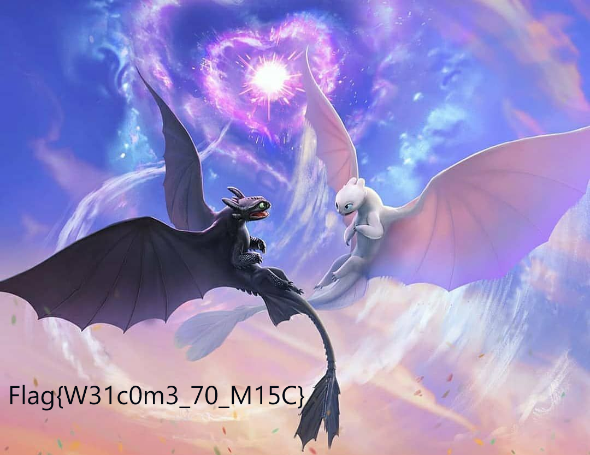
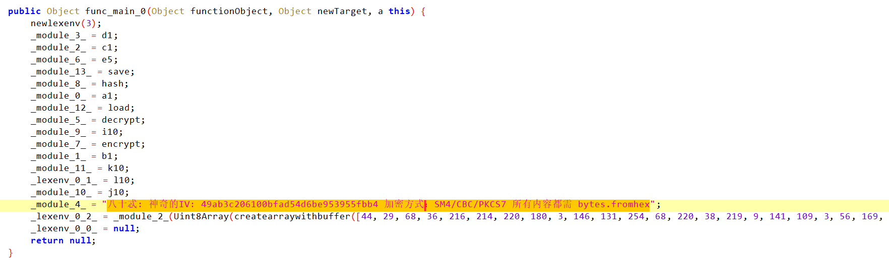
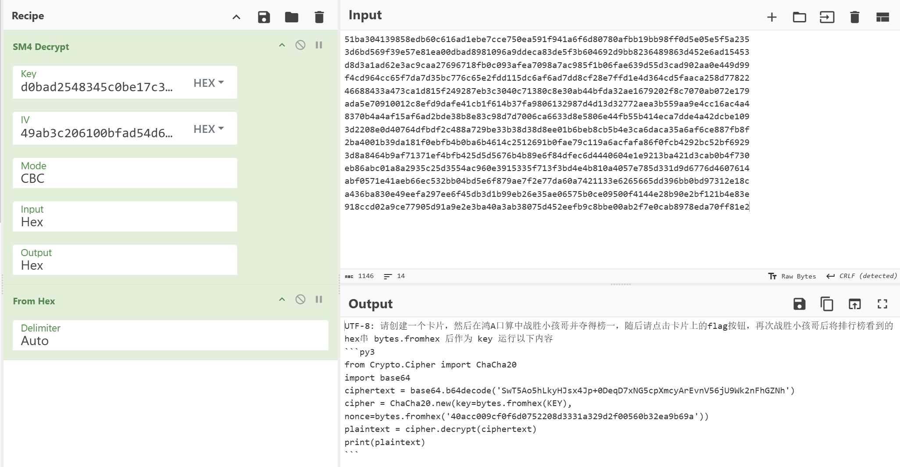

# CSACTF2025 Writeup

<center>拿了一堆flag会先领盒饭吗</center>

<center>Grapesea, H2g, 1145141919810, EmotionalEDM</center>

我们做出来的题目（除掉check in/out）是`HiddenWorld`, `babyRev`,`babyLFSR`,`ezCrypto`，排名13.

## Misc部分

###  Check In-H2g

```
Q1NBQ1RGe00xbmRzXzFudGVydHcxbmVkXyZfU2VjdXIxdHlfRDNzMWduM2R9
from Base64
CSACTF{M1nds_1ntertw1ned_&_Secur1ty_D3s1gn3d}
```

### Hidden World-H2g

高度很明显不对劲，放到工具里修一下:

```
[*] Fix-PNG执行完毕, 图片已经保存在文件所在的目录中或者同名目录中!

[-] Byxs20为您温馨提示: 正在并行爆破图片正确的宽度和高度中...
[-] 宽度: 1080, hex: 0x438
[-] 高度: 834, hex: 0x342
[-] 运行时间为：0小时 0分钟 0秒 1毫秒
[-] CRC32: 0x830E7CA6, 已经为您保存到运行目录中!
```



```
Flag{W31c0m3_70_M15C}
->
CSACTF{W31c0m3_70_M15C}
```

flag格式没给对，这个不得不吐槽一下……

### pyarmor-没做，但吐槽

整个队伍没人是MacOS环境，全都是Win，我觉得这题我们是没有可能动手去做的。（——Grapesea理直气壮地说）

### 鸿A口算-H2g做，Grapesea吐槽兼辅助

解压.hap文件，翻到了`flag.proto`

```
message flag {
  string flag = 1; // 越问：FLAG的获取方式密文在末尾
}
// 51ba304139858edb60c616ad1ebe7cce750ea591f941a6f6d80780afbb19bb98ff0d5e05e5f5a235
// 3d6bd569f39e57e81ea00dbad8981096a9ddeca83de5f3b604692d9bb8236489863d452e6ad15453
// d8d3a1ad62e3ac9caa27696718fb0c093afea7098a7ac985f1b06fae639d55d3cad902aa0e449d99
// f4cd964cc65f7da7d35bc776c65e2fdd115dc6af6ad7dd8cf28e7ffd1e4d364cd5faaca258d77822
// 46688433a473ca1d815f249287eb3c3040c71380c8e30ab44bfda32ae1679202f8c7070ab072e179
// ada5e70910012c8efd9dafe41cb1f614b37fa9806132987d4d13d32772aea3b559aa9e4cc16ac4a4
// 8370b4a4af15af6ad2bde38b8e83c98d7d7006ca6633d8e5806e44fb55b414eca7dde4a42dcbe109
// 3d2208e0d40764dfbdf2c488a729be33b38d38d8ee01b6beb8cb5b4e3ca6daca35a6af6ce887fb8f
// 2ba4001b39da181f0ebfb4b0ba6b4614c2512691b0fae79c119a6acfafa86f0fcb4292bc52bf6929
// 3d8a8464b9af71371ef4bfb425d5d5676b4b89e6f84dfec6d4440604e1e9213ba421d3cab0b4f730
// eb86abc01a8a2935c25d3554ac960e3915335f713f3bd4e4b810a4057e785d331d9d6776d4607614
// abf0571e41aeb66ec532bb04bd5e6f879ae7f2e77da60a7421133e6265665dd396bb0bd97312e18c
// a436ba830e49eefa297ee6f45db3d1b99eb26e35ae06575b0ce09500f4144e28b90e2bf121b4e83e
// 918ccd02a9ce77905d91a9e2e3ba40a3ab38075d452eefb9c8bbe00ab2f7e0cab8978eda70ff81e2
```

目前没有任何头绪，只知道这是一个密文

在网上找到了对.hap中.abc文件的逆向工具abc-decompiler，在文件中翻到了如下内容



```
八十忒: 神奇的IV: 49ab3c206100bfad54d6be953955fbb4 加密方式：SM4/CBC/PKCS7 所有内容都需 bytes.fromhex
```

加密方式确定下来思路明朗多了，还给到了偏移量IV，现在只缺一个key，直接在文件夹遍历搜索一下16进制字符串

```
find hongA -type f -exec sh -c '
  for file; do
    echo "=== $file ==="
    strings "$file" | grep -E "^[0-9a-fA-F]{16,}$" | while read -r line; do
      echo "$line"
    done
  done
' sh {} +
=== hongA/module.json ===
=== hongA/pkgContextInfo.json ===
=== hongA/ets/modules.abc ===
=== hongA/ets/widget/component_collection.json ===
=== hongA/ets/widgets.abc ===
=== hongA/pack.info ===
=== hongA/resources/rawfile/flag.proto ===
=== hongA/resources/base/media/app_icon.png ===
=== hongA/resources/base/media/bottom_icon.png ===
=== hongA/resources/base/media/startIcon.png ===
=== hongA/resources/base/profile/main_pages.json ===
=== hongA/resources/base/profile/form_config.json ===
=== hongA/resources/base/profile/backup_config.json ===
=== hongA/resources.index ===
=== hongA/libs/x86_64/libentry.so ===
d0bad2548345c0be17c3f235014f69d0
=== hongA/libs/x86_64/libc++_shared.so ===
00010203040506070809101112131415161718192021222324252627282930313233343536373839404142434445464748495051525354555657585960616263646566676869707172737475767778798081828384858687888990919293949596979899
=== hongA/libs/arm64-v8a/libentry.so ===
d0bad2548345c0be17c3f235014f69d0
=== hongA/libs/arm64-v8a/libc++_shared.so ===
```

竟然藏到依赖库里了？？

```
d0bad2548345c0be17c3f235014f69d0
```



````
UTF-8: 请创建一个卡片，然后在鸿A口算中战胜小孩哥并夺得榜一，随后请点击卡片上的flag按钮，再次战胜小孩哥后将排行榜看到的hex串 bytes.fromhex 后作为 key 运行以下内容
​```py3
from Crypto.Cipher import ChaCha20
import base64
ciphertext = base64.b64decode('SwT5Ao5hLkyHJsx4Jp+0DeqD7xNG5cpXmcyArEvnV56jU9Wk2nFhGZNh')
cipher = ChaCha20.new(key=bytes.fromhex(KEY), nonce=bytes.fromhex('40acc009cf0f6d0752208d3331a329d2f00560b32ea9b69a'))
plaintext = cipher.decrypt(ciphertext)
print(plaintext)

```
上面这个需要破解，目前H2g和Grapesea正在收拾剩下的内容~~但是暂时还没找到解决小孩哥的办法~~.


### babySteg-EmotionalEDM, H2g, Grapesea

H2g:

文件尾有假flag？

`Q1NBQ1RGezFUX1NFZU1zX0wxa0VfNF9mTDQ5fQ==`

`CSACTF{1T_SEeMs_L1kE_4_fL49}`

看bit plane很明显是有东西藏着的，但是试了好久都没搞出来，哎呀


Grapesea & EmotionalEDM：折腾了各种短学期课上的方法但都失败了.


## Rev部分

### babyRev-1145141919810

打开IDA， 发现是TEA加密（经典数字0x61C88647）

密钥是`this_isnot_a_key`

加密后的内容可知是 BC8BC8E3 9069C8DB 0731D6E5 913AEACB

两个一组反解可得：5F773057 4E6B5F75 745F7730 21214133

转写可得flag: `CSACTF{W0w_u_kN0w_t3A!!}`


## Crypto部分

### ezCrypto-Grapesea

首先，这道题前几天我做过类似的：[CryptoHack – Modular Arithmetic - Modular Binomials](https://cryptohack.org/courses/modular/bionomials/)

化简：

$$\begin{cases} c_1 \equiv (7p+2q)^{e_1} & (\operatorname{mod}N) \\ c_2 \equiv (5p+3q)^{e_2} & (\operatorname{mod}N) \end{cases} \Longrightarrow \begin{cases} c_1 \equiv (7p)^{e_1}+(2q)^{e_1} & (\operatorname{mod}N) \\ c_2 \equiv (5p)^{e_2}+(3q)^{e_2} & (\operatorname{mod}N) \end{cases} \Longrightarrow \begin{cases} c_1^{e_2}5^{e_1e_2} \equiv (35p)^{e_1e_2}+(10q)^{e_1e_2} & (\operatorname{mod}N) \\ c_2^{e_1}7^{e_1e_2} \equiv (35p)^{e_1e_2}+(21q)^{e_1e_2} & (\operatorname{mod}N) \end{cases}$$

$$ \Longrightarrow d = (21^{e_1e_2}-10^{e_1e_2})q^{e_1e_2} \equiv 7^{e_1e_2}c_2 ^{e_1}-5^{e_1e_2}c_1^{e_2} (\operatorname{mod}N)$$

所以只需要计算$gcd(d,N)$即可得到$q$.

payload:

```python
import hashlib
import itertools
import string
import re
import gmpy2
import math
from pwn import *
import numpy as np
from math import isqrt, gcd
from fractions import Fraction
from Crypto.Util.number import long_to_bytes, bytes_to_long
import sympy
from Crypto.Cipher import AES
from Crypto.Util.number import *

e1 = 9993078339649918633394551494432099987489636970426459609511857467341547586587525392554182350765642296219526020856710856746033936605501022624688690300688439
e2 = 9862231551884468205315488646474297306588640159481717035401356860971981714476971478488573347081320483033055786493180165517487943548799848155409701594695241

c  = 55901802262435214617666003592762988475817677710371853541720344698764787306707874639847782579629332096055942013026505176416985974919479004417458085456394043275360903171536103053583251790628518753952543060780848158606515610299846413376493573042907292759220155160589910184410059973310831818961560671734593013630
c1 = 40229355340269257739770896034955847330470882389629386052431564363238466271625576412466245834179497302499769847960940723672643383320214407820912062076710617921419054040241577412851511347542787094945856317937066896047259364036219750643961105485688761317530941590187661063644339339132904752238067549935799782571
c2 = 108652869706106291871386712591832466805988235376235028871549478999408715358581148050182998755845373693039547262558657853346202467672844967103554943949936653904766808010459876413771263811562198412823905652758929593346690671565576513949878548572013852099780538278374113587286504177003549471221734542094445566120
N  = 123839153520968617938577833129088685928809498127935146762079913125478804855691345286939880475076303747964774752204834042336906860535767909827360494225337089627632868095483264748780029629372118516765073006866472031753085514995841735096285162728251392742484862333235342283728891342849728490662261106037625078371
d0 = pow(7,e1*e2,N)*pow(c2,e1,N) - pow(5,e1*e2,N)*pow(c1,e2,N)
  
p = gcd(d0,N)
q = N//p
print(f"{p},{q}")
e = 65537
assert gmpy2.is_prime(p)
assert gmpy2.is_prime(q)
assert p * q == N

phi = (p-1)*(q-1)

d = gmpy2.invert(e,phi)
m = pow(c,d,N)
print(m)
flag = long_to_bytes(m)
print(flag)
# 然后丢到cyberchef里面！！！犯傻了错失三血
```

flag: `CSACTF{Go0d_JoB!_We1C0mE_t0_oUR_csACtF_2o25!}`

### babyLFSR-Grapesea

本来只是想习惯性地打开CTF Wiki学一下这个LFSR（实则是NFSR，前几天看到这个知识点但来不及学了）

结果谁知道writeup是现成的（摊手）：

[非线性反馈移位寄存器 - CTF Wiki](https://ctf-wiki.org/crypto/streamcipher/fsr/nfsr/)

[【复现】强网杯-StreamGame3-Writeup – Rhy7hm](https://rhythmmark.github.io/StreamGame3-Writeup/)

与2018强网杯的题目甚至是一样的，就不重复写了.

