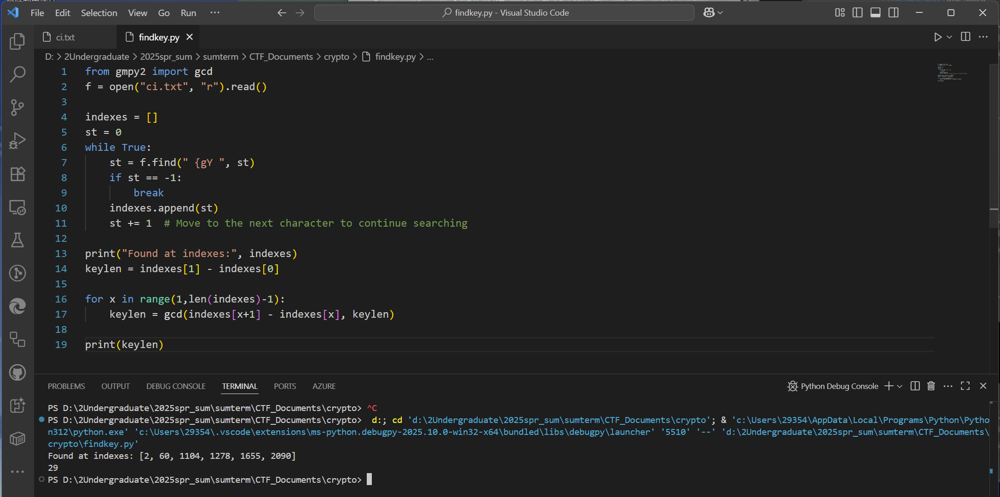
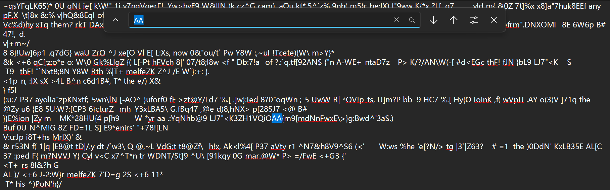
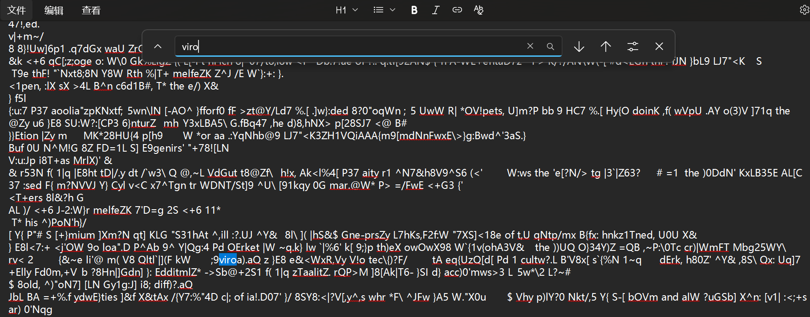
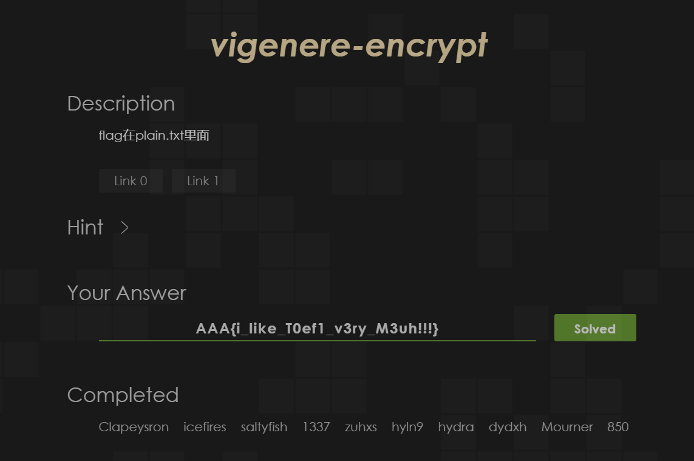
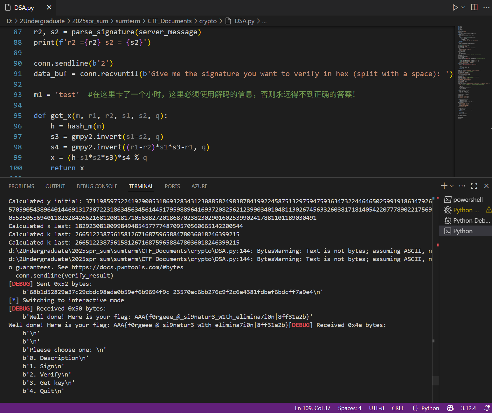
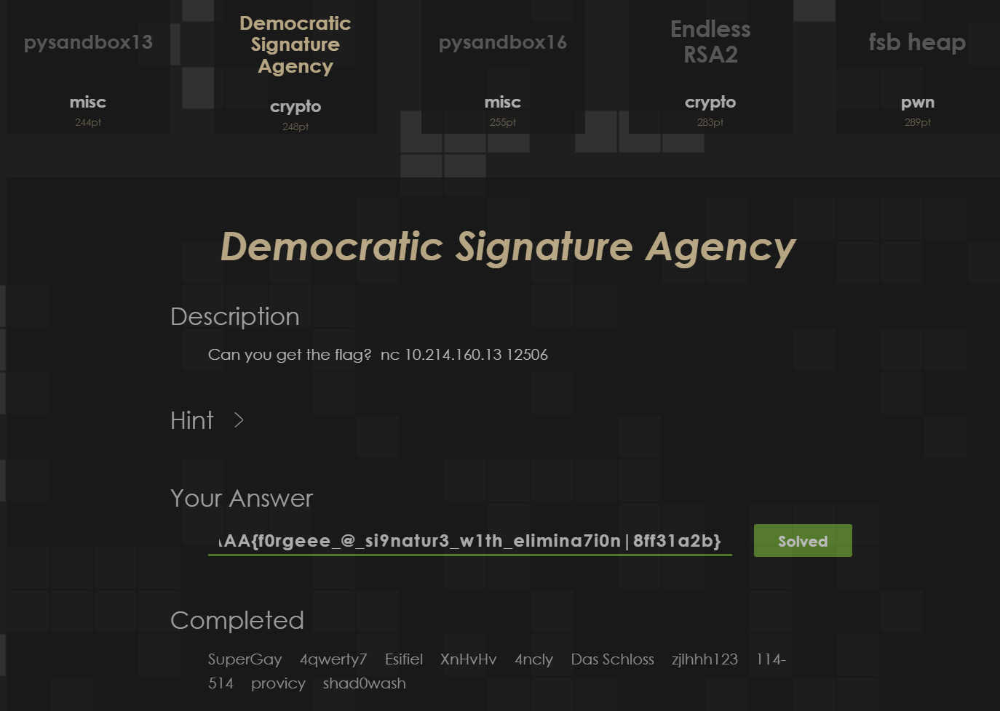

# Crypto Lab 1：消息加密和数字签名 Report

## Task (40%)（√）

> 完成 ZJU School-Bus 上的 [vigenere-encrypt](https://zjusec.com/challenges/31) 一题，在实验报告中简单描述这道题的做法。如果没法完整做出，也可以叙述自己的思路和解题过程，会根据完成情况给分。本题分值 40 分。

本题目的完整破解代码放在了findkey.py中，过程文件为：ci.txt, de.txt, partial1.txt, partial2.txt, partial3.txt.

以下是完整推理过程：


首先观察出现重复的特殊字符串，注意到`{gY`出现过很多次，于是可以写一段代码来检测每一次出现的角标：

```python
from gmpy2 import gcd
f = open("ci.txt", "r").read()

indexes = []
st = 0
while True:
    st = f.find(" {gY ", st)
    if st == -1:
        break
    indexes.append(st)
    st += 1  # Move to the next character to continue searching

print("Found at indexes:", indexes)
keylen = indexes[1] - indexes[0]

for x in range(1,len(indexes)-1):
    keylen = gcd(indexes[x+1] - indexes[x], keylen)

print(keylen)
```

得到的结果是：



阅读原加密代码，可以知道密钥的长度是29：

```python
from random import randrange

text_list=' !"#$%&\'()*+,-./0123456789:;<=>?@ABCDEFGHIJKLMNOPQRSTUVWXYZ[\\]^_`abcdefghijklmnopqrstuvwxyz{|}~\t\n'

key=[randrange(1,97) for i in range(randrange(15,30))] #从这里看出来长度是29

print('key = '+str(key))

def encrypt(s,k):
    out=''
    for i in range(len(s)):
        index=text_list.index(s[i])
        index*=k[i%len(k)]
        index%=97
        out+=text_list[index]
    return out

plain=open('plain.txt','r').read() # TOEFL reading passage
cipher=encrypt(plain,key)
open('cipher.txt','w').write(cipher)
```

可以使用逆元的想法来解决这个问题，书写以下代码来还原为源文本：

```python
textlist=' !"#$%&\'()*+,-./0123456789:;<=>?@ABCDEFGHIJKLMNOPQRSTUVWXYZ[\\]^_`abcdefghijklmnopqrstuvwxyz{|}~\t\n'
now = "{gY"
past = "the"
key = [1 for i in range(29)]
for i in range(3):
    nowp = textlist.index(now[i])
    pastp = textlist.index(past[i])
    key[3+i] = nowp * invert(pastp, 97) % 97
    print(key[3+i])    # 以上获得的key用在下面的解密过程中

def decrypt(s,key):
    out = ''
    for i in range(len(s)):
        preindex = invert(key[i % len(key)], 97) * textlist.index(s[i]) % 97
        out += textlist[preindex]
    return out
decrypted_text = decrypt(f, key)
open('de.txt', 'w').write(decrypted_text)
```

输出结果是：


打开`de.txt`，注意到：



于是我们可以多破解一个：A->O

进一步修改代码。为了看清楚一点，我们输出已经解码的部分：

```python
textlist=' !"#$%&\'()*+,-./0123456789:;<=>?@ABCDEFGHIJKLMNOPQRSTUVWXYZ[\\]^_`abcdefghijklmnopqrstuvwxyz{|}~\t\n'
now = "{gY"
past = "the"
now1 = 'O'
past1 ='A'
key = [1 for i in range(29)]
for i in range(3):
    nowp = textlist.index(now[i])
    pastp = textlist.index(past[i])
    key[3+i] = nowp * invert(pastp, 97) % 97
    print(key[3+i])    # 以上获得的key用在下面的解密过程中
nowp = textlist.index(now1)
pastp = textlist.index(past1)
key[2] = nowp * invert(pastp, 97) % 97

def decrypt(s,key):
    out = ''
    for i in range(len(s)):
        preindex = invert(key[i % len(key)], 97) * textlist.index(s[i]) % 97
        out += textlist[preindex]
    return out
decrypted_text = decrypt(f, key)
for i in range(len(decrypted_text)//29):
    print(decrypted_text[i*29+2:i*29+6])

open('de.txt', 'w').write(decrypted_text)
```

输出的内容放在partial-1.txt。

接下来就是attention is all you need 的阶段。在这份文档里，我看到一个viro，含这个片段的部分：



一眼丁真，猜测为environment

继续修改代码进行破解：

```python
textlist=' !"#$%&\'()*+,-./0123456789:;<=>?@ABCDEFGHIJKLMNOPQRSTUVWXYZ[\\]^_`abcdefghijklmnopqrstuvwxyz{|}~\t\n'
now = "{gY"
past = "the"
now1 = 'O'
past1 ='A'
now2 = ';9'
past2 = 'en'
now3 = 'a).aQ'
past3 = 'nment'

key = [1 for i in range(29)]
for i in range(3):
    nowp = textlist.index(now[i])
    pastp = textlist.index(past[i])
    key[3+i] = nowp * invert(pastp, 97) % 97

nowp = textlist.index(now1)
pastp = textlist.index(past1)
key[2] = nowp * invert(pastp, 97) % 97

for i in range(2):
    nowp = textlist.index(now2[i])
    pastp = textlist.index(past2[i])
    key[i] = nowp * invert(pastp, 97) % 97

for i in range(5):
    nowp = textlist.index(now3[i])
    pastp = textlist.index(past3[i])
    key[i+6] = nowp * invert(pastp, 97) % 97
print(key)

def decrypt(s,key):
    out = ''
    for i in range(len(s)):
        preindex = invert(key[i % len(key)], 97) * textlist.index(s[i]) % 97
        out += textlist[preindex]
    return out
decrypted_text = decrypt(f, key)
for i in range(len(decrypted_text)//29):
    print(decrypted_text[i*29:i*29+11])

open('de.txt', 'w').write(decrypted_text)
```

输出的内容放在partial-2.txt。

初见端倪，这表明key[28]是`h`到`8`的映射（从`ousehold`的前一位推断），key[11:14]是`tor`到`XOM`的映射（从`refrigera`的后三位推断）

继续修改，得到partial-3.txt。

key[14:16]是`gh`到`yE`的映射（从`althou`的后两位推断）

将输出的覆盖入partial-3.txt。


接下来聚焦到第一句话，从partial3.txt中的：

> By the mid-ninet
> , the term "iceb

以及原文的：

> By the mid-ninet85SY8 o:|k'yy, the term

容易猜出句意是By the mid-nineteenth century, the term ……

于是又可以更新一些猜测进入，这样就破解完成了：


所以最终定格原文是：

> By the mid-nineteenth century, the term "icebox" had entered the American language, but ice was still only beginning to affect the diet of ordinary citizens in the United States. The ice trade grew with the growth of cities. Ice was used in hotels, taverns, and hospitals, and by some forward-looking city dealers in fresh meat, fresh fish, and butter.After the Civil War (1861-1865), as ice was used to refrigerate freight cars, it also came into household use. Even before 1880, half the ice sold in New York, Philadelphia, and Baltimore, and one-third of that sold in Boston and Chicago, went to families for their own use. This had become possible because a new household convenience, the icebox, a precursor of the modern refrigerator, had been invented.
> Making an efficient icebox was not as easy as we might now suppose. In the early nineteenth century, the knowledge of the physics of heat, which was essential to a science of refrigeration, was rudimentary. The commonsense notion that the best icebox was one that prevented the ice from melting was of course mistaken, for it was the melting of the ice that performed the cooling.
> Nevertheless, early efforts to economize ice included wrapping the ice in blankets, which kept the ice from doing its job. Not until near the end of the nineteenth century did inventors achieve the delicate balance of insulation and circulation needed for an efficient icebox.
> fLaG:AAA{i_like_T0ef1_v3ry_M3uh!!!}
> But as early as 1803, an ingenious Maryland farmer, Thomas Moore, had been on the right track. He owned a farm about twenty miles outside the city of Washington, for which the village of Georgetown was the market center. When he used an icebox of his own design to transport his butter to market, he found that customers would pass up the rapidly melting stuff in the tubs of his competitors to pay a premium price for his butter, still fresh and hard in neat, one-pound bricks.
> One advantage of his icebox, Moore explained, was that farmers would no longer have to travel to market at night in order to keep their produce cool.
> Perhaps the most obvious way artistic creation reflects how people live is by mirroring the environment - the materials and technologies available to a culture. Stone, wood, tree bark, clay, and sand are generally available materials. In addition, depending on the locality, other resources may be accessible: shells, horns, gold, copper, and silver. The different uses to which societies put these materials are of interest to anthropologists who may ask, for example, why people choose to use clay and not copper when both items are available. Although there are no conclusive answers yet, the way in which a society views its environment is sometimes apparent in its choice and use of artistic materials. The use of certain metals, for example, may be reserved for ceremonial objects of special importance. Or the belief in the supernatural powers of a stone or tree may cause a sculptor to be sensitive to that material.
> What is particularly meaningful to anthropologist is the realization that although the materials available to a society may to some extent limit or influence what it can do artistically, the materials by no means determine what is done. Why do the artists in Japanese society rake sand into patterns; and the artists in Roman society melt sand to form glass? Moreover, even when the same material is used in the same way by members of different societies, the form or style of the work varies enormously from culture to culture. A society may simply choose to represent objects or phenomena that are important to its population. An examination of the art of the Middle Ages tells us something about the medieval preoccupation with theological doctrine. In addition to revealing the primary concerns of a society, the content of that society's art may also reflect the culture's social stratification.

其中flag是`AAA{i_like_T0ef1_v3ry_M3uh!!!}`

通过结算画面：




## Challenges & bonus (75%) （60% √）

> 除了古典密码外，现代密码学也有很多有趣的内容。课上的介绍几乎涵盖了如今密码学的大部分内容，比如对称加密的流密码攻击、非对称加密的 RSA 及应用、DSA 数字签名的构建和验证、哈希函数的扩展攻击、随机数的预测等，大家可以根据自身情况选择感兴趣的内容进行深入学习。
>
> 本模块主要考察同学们通过网络资源学习密码学的能力（当然课上也已经讲解了大致的攻击方向），根据题目的难度设置对应的分值，大家可以任选一道或多道题目完成，但是该模块分数不溢出 75 分。
>

### DSA 数字签名的构建和验证 (60%+15%)

> DSA 数字签名算法是现代密码学中重要的数字签名算法之一，广泛应用于各种安全协议中。在课上我们介绍了 DSA 的基本原理和签名验证过程，也简要介绍了相关的攻击方式。
>
> 你可能需要参考 DSA签名的线性随机数 k 攻击 来完成本题。
>
> 本 Challenge 需要完成 ZJU School-Bus 上的 [Democratic Signature Agency](https://zjusec.com/challenges/85) 一题，在实验报告中简单描述这道题的做法。完成本题可以获得 60 分。
>
> - （慎选）如果你完成了 ZJU School-Bus 上的 [D.S.A Revenge](https://zjusec.com/challenges/118)，你会获得额外的 15 分奖励。
>
> 如果没法完整做出，也可以叙述自己的思路和解题过程，会根据完成情况给分。
>

#### $\textcolor{red}{DSA}$ （√）

在网上查找了一下DSA签名算法的过程：

密钥选取：

1. 首先指定素数$p,q$，其中$p$的长度是$L$，$q$的长度是$N<L$；

2. 现在我们用以下方法找到合适的$g$，满足$q$是满足$g^q \equiv 1 (\operatorname{mod} p)$的最小满足值：

   遍历$h = 2 \to p-2$的所有值，令$g = h^{\frac{p-1}{q}}\%p$且$g^k\equiv 1(\operatorname{mod} p)$的最小正整数解是$q$；

3. 再选一个私钥$0<x<q$，取满足以下条件的$0<y<p$：$y \equiv g^x (\operatorname{mod}p)$；

   这样就完成了公钥$p,q,g,y$和私钥$x$的选择。

签名过程：

1. 随机选择临时密钥$k(0<k<q)$（且不能重用，否则就会像这个题目一样被攻击）；

2. $\begin{cases} r \equiv (g^k \% p) \% q & (\operatorname{mod}q) \\ s \equiv (H(m) + xr) k^{-1}\%q & (\operatorname{mod} q)\end{cases}$

   于是签名结果就是$(r,s)$

验证过程：

1. 计算辅助值，$w=s^{-1}(\operatorname{mod}q)$

2. 计算辅助值，$u_1=H(m)w$ (mod $q$)

3. 计算辅助值，$u_2=rw$ (mod $q$)

4. 计算$v=(g^{u_{1}}y^{u_{2}}\operatorname{mod}p)$ (mod $q$)

5. 如果$v = r$，则校验成功。


我的破解思路：

当$m_1 = m_2$时，有$H(m_1) = H(m_2)$，设为$H(m)$

两个签名变为：$\begin{cases}s_1 \equiv k_1^{-1}(H(m) + xr_1) & (\operatorname{mod} q)\\
s_2 \equiv (k_1+1)^{-1}(H(m) + xr_2) & (\operatorname{mod} q)\end{cases}$

化简得：$4(x(r_1 - r_2) + s_2)(s_1 - s_2)^{-1}s_1 \equiv H(m) + xr_1 (\operatorname{mod} q)$

解得 $x \equiv (H(m) - s_2s_1(s_1 - s_2)^{-1})[(r_1 - r_2)s_1(s_1 - s_2)^{-1} - r_1]^{-1} (\operatorname{mod} q)$

---

对话round1：

```python
$  nc 10.214.160.13 12506
sha256(str).hexdigest()[-6:] == xxxxxx # 某6位SHA值
Give me str:
```

所以依照这一交互书写代码的第一部分：

```python
import socket
import hashlib
import itertools
import string
import re
import requests 
from pwn import *

context.log_level = "debug"

def hash(text):
    return hashlib.sha256(text.encode()).hexdigest()[-6:]

def getkey(_input):
    print(_input)
    charset = string.ascii_letters + string.digits
    cnt = 0
    for i in range(1,7):
        for cmb in itertools.product(charset, repeat=i):
            key = ''.join(cmb)
            cnt += 1
            if hash(key) == _input:
                print(f"Key found: {key} after {cnt} attempts")
                return key
    return None

conn = remote("10.214.160.13", 12506)
data = conn.recvuntil(b'Give me str:')
server_message = data.decode()
print(server_message)
match = re.search(r'== ([0-9a-fA-F]{6})',server_message)
if match:
    _input = match.group(1).lower()
    print(f"Get:{_input}")

result = getkey(_input)
if result:
    print(result)
    conn.sendline(result)

conn.interactive()
conn.close()
```

运行以后获得了以下内容：

```
Plaese choose one:
0. Description
1. Sign
2. Verify
3. Get key
4. Quit
```

选择0，得到了以下提示：

```bash
Here are partial source codes:
def sign(m, x, p, q, g):
    global k
    r = pow(g, k, p) % q
    s = invert(k, q) * (x * r + int(sha256(m).hexdigest(), 16)) % q
    k += 1
    return (r, s)

def verify(r, s, y, p, q, g):
    u = invert(s, q) * int(sha256('Plz give me the flag!').hexdigest(),16)
    v = invert(s, q) * r
    return pow(g, u, p) * pow(y, v, p) % p % q == r
```

根据DSA签名算法，我感觉现在我需要破解私钥$x$，并且返回我伪造的信息。

此处$H(m) =$ `int(sha256(m).hexdigest(), 16)`，意思是把message用SHA256加密之后转成16进制字符串再转成整数。


选择1，得到以下提示：

```bash
Give me the msg you want to sign in hex:
```

输入`74657374`（test的Hex值），得到：

```bash
Here is your signature: r_1 , s_1
```

再次输入`74657374`，得到：

```bash
Here is your signature: r_2 , s_2
```

以上代替了实际输出的$r,s$两个数

选择2，得到以下提示：

```bash
Give me the signature you want to verify in hex (split with a space):
```

选择3并输入`test`的Hex，得到以下提示：（以下是举例）

```bash
p: 0x---------------L
q: 0x------L
g: 0x----------L
```

于是我们基于以上交互不断地尝试并debug代码，最后通过拿到flag的是以下的`DSA.py`：

```python
import hashlib
import itertools
import string
import re
import gmpy2
import requests 
from pwn import *

context.log_level = "debug"

def hash(text):
    return hashlib.sha256(text.encode()).hexdigest()[-6:]

def getkey(_input):
    print(_input)
    charset = string.ascii_letters + string.digits
    cnt = 0
    for i in range(1,7):
        for cmb in itertools.product(charset, repeat=i):
            key = ''.join(cmb)
            cnt += 1
            if hash(key) == _input:
                print(f"Key found: {key} after {cnt} attempts")
                return key
    return None

def hash_m(m):
    hex_hash = hashlib.sha256(m.encode()).hexdigest()
    return int(hex_hash, 16)

conn = remote("10.214.160.13", 12506)
data = conn.recvuntil(b'Give me str:')
server_message = data.decode()
print(server_message)
match = re.search(r'== ([0-9a-fA-F]{6})',server_message)
if match:
    _input = match.group(1).lower()
    print("\033[91m这是交互第一轮\033[0m")
    print(f"Get:{_input}")

result = getkey(_input)
if result:
    print(result)
    conn.sendline(result)

data_buf = conn.recvuntil(b'4. Quit\n')  #这个参数没什么用，留下作为缓冲
conn.sendline(b'3')
data2 = conn.recvuntil(b'4. Quit\n')
server_message = data2.decode()
print(server_message)

hex_numbers = re.findall(r'0x[0-9a-f]+L', server_message) # 使用findall找到所有16进制数

if len(hex_numbers) >= 2:
    p = int(hex_numbers[0].replace('0x', '').replace('L', ''), 16)
    q = int(hex_numbers[1].replace('0x', '').replace('L', ''), 16)
    g = int(hex_numbers[2].replace('0x', '').replace('L', ''), 16)
    print(f"Get publickey: p: {p}, q: {q}, g: {g}")

def parse_signature(server_message):
    pattern = r'signature:\s*([0-9a-f]+)\s*,\s*([0-9a-f]+)'
    match = re.search(pattern, server_message, re.IGNORECASE)

    if match:
        r = int(match.group(1), 16)
        s = int(match.group(2), 16)
        return r, s
    return None, None

conn.sendline(b'1')
data_buf = conn.recvuntil(b'Give me the msg you want to sign in hex: ') 
conn.sendline(b'74657374')     # 这个是test的Hex
data_buf = conn.recvuntil(b'4. Quit')
server_message = data_buf.decode()
print("\033[91mThe 1st signature:\033[0m")
print(server_message)
r1, s1 = parse_signature(server_message)
print(f'r1 ={r1} s1 = {s1}')

conn.sendline(b'1')
data_buf = conn.recvuntil(b'Give me the msg you want to sign in hex: ')
conn.sendline(b'74657374')     # 这个是test的Hex
data_buf = conn.recvuntil(b'4. Quit')
server_message = data_buf.decode()
print("\033[91mThe 2nd signature:\033[0m")
print(server_message)
r2, s2 = parse_signature(server_message)
print(f'r2 ={r2} s2 = {s2}')

conn.sendline(b'2') 
data_buf = conn.recvuntil(b'Give me the signature you want to verify in hex (split with a space): ')

m1 = 'test'  #在这里卡了一个小时，这里必须使用解码的信息，否则永远得不到正确的答案！

def get_x(m, r1, r2, s1, s2, q):
    h = hash_m(m)
    s3 = gmpy2.invert(s1-s2, q)
    s4 = gmpy2.invert((r1-r2)*s1*s3-r1, q)
    x = (h-s1*s2*s3)*s4 % q
    return x

def get_k(m, r1, r2, s1, s2, x, q):
    h = hash_m(m)
    r1_inv = gmpy2.invert(r1, q)
    k = ((s1 * x + h) * r1_inv) % q
    return k 

x = get_x(m1, r1, r2, s1, s2, q)          
k = get_k(m1, r1, r2, s1, s2, x, q) 
y = pow(g, x, p)

print(f"Calculated x initial: {x}")
print(f"Calculated k initial: {k}")
print(f"Calculated y initial: {y}")

def verify(m, r, s, y, p, q, g):
    h = hash_m(m)
    u = gmpy2.invert(s, q) * h
    v = gmpy2.invert(s, q) * r
    return pow(g, u, p) * pow(y, v, p) % p % q == r
flag = verify(m1, r1, s1, y, p, q, g)
if flag:
    print(f"Calculated x last: {x}")
    print(f"Calculated k last: {k}")
else:
    print("\033[91mFailed\033[0m")
m = "Plz give me the flag!"
k1 = k+1

def sign(m, x, p, q, g, k):
    h = hash_m(m)
    r = pow(g, k, p) % q
    s = gmpy2.invert(k, q) * (x * r + h) % q
    return r, s

def signature(r, s):
    r_hex = f"{r:x}"
    s_hex = f"{s:x}"
    return f"{r_hex} {s_hex}"

r,s = sign(m, x, p, q, g, k1)
verify_result = signature(r,s)

conn.sendline(verify_result)  
conn.interactive()
conn.close()
```


所以flag是：`AAA{f0rgeee_@_si9natur3_w1th_elimina7i0n|8ff31a2b}`


通过结算画面：






#### $\textcolor{red}{Bonus：DSA~Revenge}$ （×）

类似上题DSA的$k$复用情况，我的破解思路：

当$m_1 = m_2$时，有$H(m_1) = H(m_2)$，设为$H(m)$

两个签名变为：$\begin{cases}s_1 \equiv (k>>160)^{-1}(H(m) + xr_1) & (\operatorname{mod} q)\\
s_2 \equiv [(ak+b)\%c>>160]^{-1}(H(m) + xr_2) & (\operatorname{mod} q) \end{cases}$

解得 $x \equiv ??? (\operatorname{mod} q)$


类似上面题目的代码思路，先破解第一轮交互：

```python
import hashlib
import itertools
import string
import re
import gmpy2
import requests 
from pwn import *

''' 第一次交互的内容：
Here comes your challenge:
sha256(XXXX + 8sR5kmZEhCr9EFUe) == fe82db438bf7e732c63467aa0e8bdbdc153cf1a17eddad260d729c27fb892f08
Give me XXXX:
'''
context.log_level = "debug"
conn = remote("10.214.160.13", 12710)
data = conn.recvuntil(b'Give me XXXX:')
server_message = data.decode()
print(server_message)

def string1(server_message):
    pattern = r'sha256\(XXXX\s*\+\s*([0-9a-zA-Z]+)\)\s*==\s*([0-9a-f]+)'
    match = re.search(pattern, server_message, re.IGNORECASE)

    if match:
        r = match.group(1)
        s = match.group(2)
        return r, s
    return None, None

r,s = string1(server_message)
print("\033[91m这是交互第一轮\033[0m")
print(f'Extracted: r:{r}, s:{s}')

def getxxxx(r,s):
    charset = string.ascii_letters + string.digits
    cnt = 0
    for i in range(1,7):
        for cmb in itertools.product(charset, repeat=i):
            key = ''.join(cmb)
            cnt += 1
            if (cnt % 10000000 == 0):
                print(cnt)
            if hashlib.sha256((key + r).encode()).hexdigest() == s:
                print(f"Key found: {key} after {cnt} attempts")
                return key
    return None

result = getxxxx(r,s)
print(f"找到的XXXX: {result}")
conn.sendline(result)
```


得到了一样的验证：

```bash
Plaese choose one:
0. Description
1. Sign
2. Verify
3. Get key
4. Quit
```

先输入0，得到：

```python
Here are partial source codes:
def sign(m, x, p, q, g):
    global k
    k = (0x114514191981011451419198101145141919810114514 * k + 114514191981011451419198101145141919810114514) % 0x461dfd2563cd550adcf9882229c456078d62a4cf83cc69e91264ae5de1c3a6be4078c27eb7b7d68d
    k_bar = k >> 160
    r = pow(g, k_bar, p) % q
    s = invert(k_bar, q) * (x * r + int(sha256(m).hexdigest(), 16)) % q
    return (r, s)

def verify(r, s, y, p, q, g):
    u = invert(s, q) * int(sha256('Plz give me the flag again!').hexdigest(),16)
    v = invert(s, q) * r
    return pow(g, u, p) * pow(y, v, p) % p % q == r
```


跟上题$k$的复用情况类似，$H(m),p,q,g$等参数的给出方法是一样的. 

（以下是上一题的终端输出，看上去是类似的破解方法）

```python
Here are partial source codes:
def sign(m, x, p, q, g):
    global k
    r = pow(g, k, p) % q
    s = invert(k, q) * (x * r + int(sha256(m).hexdigest(), 16)) % q
    k += 1
    return (r, s)

def verify(r, s, y, p, q, g):
    u = invert(s, q) * int(sha256('Plz give me the flag!').hexdigest(),16)
    v = invert(s, q) * r
    return pow(g, u, p) * pow(y, v, p) % p % q == r
```

现在我们估测一下里面的参数的大小，找了一组数据验证：

```python
a = int('0x114514191981011451419198101145141919810114514',16)
b = 114514191981011451419198101145141919810114514
c = int('0x461dfd2563cd550adcf9882229c456078d62a4cf83cc69e91264ae5de1c3a6be4078c27eb7b7d68d',16)
q = 1417425058303542881682039064912574705593382528017
t = (a * q + b) % c >> 160
if (t > 0):
    print(1)
else:
    print(0)
```

输出结果是1.


个人感觉因为$k_{bar} = (ak+b)\%c>>160$的存在，所以需要对原算法改些参数和逻辑，折腾一番得到了一个暴力破解的代码：DSArevenge.py，考虑到时间复杂度非常大，需要跑好久且不一定能成功所以暂时搁置了（大哭


> 问了下等风哥哥，这个题要用格规约做，参考论文是 “Pseudo-Random” Number Generation within Cryptographic Algorithms: the DSS Case ，等后面再研究一下……


### 其他（√）

> 当然，密码学的内容远不止于此，你可以根据自己的兴趣和能力选择其他的密码学内容进行学习和挑战。欢迎自行选择一种现代密码学的内容进行深入学习和挑战，并与密码学助教联系评估分值（可能会比较严格），如果你对上述题目的分值评估有异议，或者需要针对某题释放更多的hint，也可以与密码学助教沟通。
>
> 如果有对本节基础课程有什么建议或者感想，视情况给予额外的奖励，但是不会超过 10 分。
>
> 如果你有能力完成了以上全部的题目，队长一定会请你喝茶的😀


想听到多一点的的密码学实操知识。

课上仅讲解了数论相关的一些密码学理论，感觉学得稍微有点困惑，课后花了很多时间查资料，理解上还是存在一点疑难和问题。比如DSA的x,y取值范围，CTFwiki上并没有提到这个细节，导致我一开始纠结了好久。


