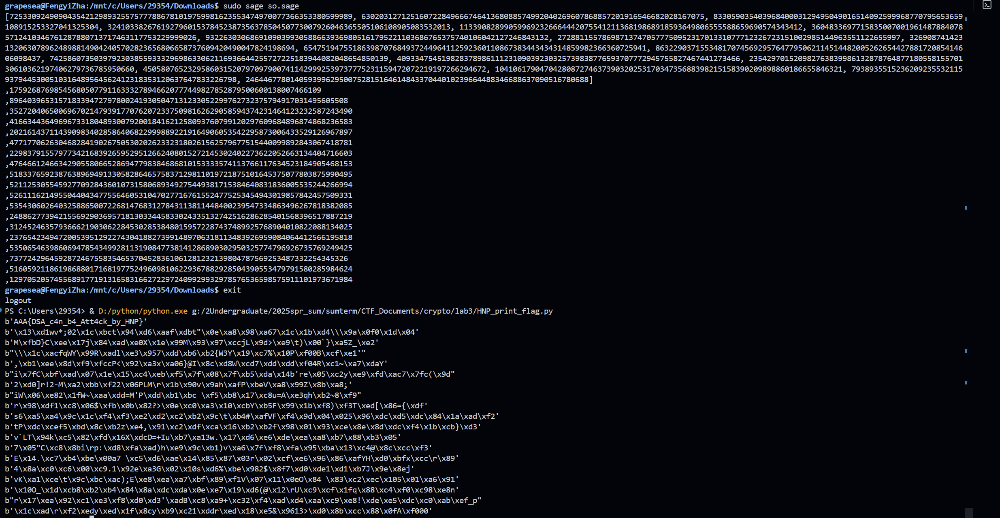
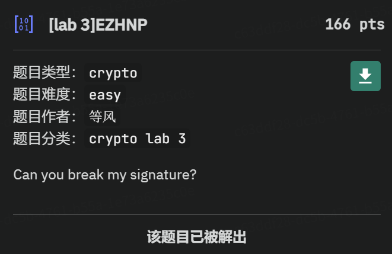

# Crypto Lab 3：格密码 Report

<center>混合2406 查沣翊 3240104505 （Grapesea）</center>

<center><b>DDL:8.5 23:59</b></center>

> 实验需要提交实验报告。每道做出来的题均需要写在实验报告中，否则无法给分。**实验报告需要写出每道题的思路并贴上攻击脚本（payload）**。对于没法完整做出的题，也可以叙述自己的思路和解题过程，会酌情给分。
>
> 本次crypto lab涉及到的内容需要深入理解格基规约和Coppersmith方法，希望同学们能够多多利用搜索引擎进行学习，同时强烈建议自己手动调试示例程序以深刻理解，不懂的地方可以向助教求助
>
> 本次两道题目均部署在[ZJUCTF](https://ctf.zjusec.com/games/5)平台上

<center>感动泪目，一个晚上纠正了这两道题2天的究极困扰，Dengfenggg大好人我会向学弟学妹强推crypto的.</center>

格基规约：

* 格：整数向量空间上若干个向量的整系数线性组合张成的空间. 基向量可以自由选取.

* 格基规约：通过给定格基将其约化到更短的、更近似正交的格基的过程.（类似Schmidt正交化）

* 相关问题：错误学习问题、SVP etc.


椭圆曲线数字签名算法的过程：

```python
def sign(msg, sk):
	h = bytes_to_long(sha256(msg).digest())
	k = getPrime(240)
	P = k * G
	r = int(P.xy()[0]) % n
	s = inverse(k, n) * (h + r * sk) % n
	return (r, s)
```

Hash函数：SHA256加密后转换成长整型$h$.

首先接受消息$msg$和私钥$sk$.

一次性私钥$k$：240bits的随机质数.

现在计算椭圆曲线的点$P = k*G$，其中$G(x,y)$，并且获取签名分量$r = P_x (\operatorname{mod} n)$，即$P$点$x$坐标取模. **如果 $r$ 为 0，则需要重新生成 $k$ 并重新开始.**

签名分量的计算：

计算$l = k^{-1} (\operatorname{mod} n)$，然后代入：$s = l*(h+r*sk)(\operatorname{mod} n)$. **如果$s$为 0，则需要重新生成$k$并重新开始.**

返回签名：$(r,s)$.

<br/>

验证过程：

1. **检查签名有效性**：确保 `r` 和 `s` 都在 `[1, n-1]` 的范围内。

2. **计算消息哈希**：和签名过程一样，计算 `h = sha256(msg)`。

3. **计算辅助值**：
   * `w = inverse(s, n)`
   * `u1 = h * w % n`
   * `u2 = r * w % n`

4. **计算验证点**： `P' = u1 * G + u2 * pk`。

- 这里利用了公钥 `pk`。由于 `pk = sk * G`，我们可以将这个式子展开： $P′=u1⋅G+u2⋅(sk⋅G)=(u1+u2⋅sk)⋅G(\operatorname{mod}n)$
- 通过代入 `u1`, `u2`, `w`, `s` 的值，最终可以证明 `P'` 的$x$坐标将等于签名分量 `r`。

5. **验证**：`v = int(P'.xy()[0]) % n`。如果 `v` 等于 `r`，则签名有效，否则无效。


## 格基规约部分（50'）（√）

> [EZHNP](https://ctf.zjusec.com/games/5/challenges)

看意思是Hidden Number Problem，不知道该干什么的时候先观察源码：

```python
from Crypto.Util.number import *
from random import randint
from hashlib import sha256
from secret import flag

def sign(msg, sk):
	h = bytes_to_long(sha256(msg).digest())
	k = getPrime(240)
	P = k * G
	r = int(P.xy()[0]) % n
	s = inverse(k, n) * (h + r * sk) % n
	return (r, s)

sk = bytes_to_long(flag)
p = 2^256 - 2^32 - 977
a = 0
b = 7
x = 0x79BE667EF9DCBBAC55A06295CE870B07029BFCDB2DCE28D959F2815B16F81798
y = 0x483ADA7726A3C4655DA4FBFC0E1108A8FD17B448A68554199C47D08FFB10D4B8
n = 0xFFFFFFFFFFFFFFFFFFFFFFFFFFFFFFFEBAAEDCE6AF48A03BBFD25E8CD0364141
msg = b"message_to_sign"
t = 18

E = EllipticCurve(GF(p), [a, b])
G = E(x, y)

R = []
S = []
for _ in range(t):
    (r, s) = sign(msg, sk)
    R.append(r)
    S.append(s)

print(f"R = {R}")
print(f"S = {S}")

'''
R = # 一个18维大数组
S = # 另一个18维大数组
'''
```

首先这个`sign()`是ECDSA，题目给出了18组$(r,s)$数据；

`E = EllipticCurve(GF(p), [a, b])`表明曲线是$y^2 = x^3+7$，而且之后的操作都需要对$p$取模.


使用Sagemath书写以下代码：（存放在`solution.py`里面）

```python
from sage.all import *
from hashlib import sha256

p = 2^256 - 2^32 - 977
n = 0xFFFFFFFFFFFFFFFFFFFFFFFFFFFFFFFEBAAEDCE6AF48A03BBFD25E8CD0364141
a = 0
b = 7
x_G = 0x79BE667EF9DCBBAC55A06295CE870B07029BFCDB2DCE28D959F2815B16F81798
y_G = 0x483ADA7726A3C4655DA4FBFC0E1108A8FD17B448A68554199C47D08FFB10D4B8
msg = b"message_to_sign"

h = Integer(sha256(msg).hexdigest(), 16)

t = 18 
R = [] # 略
S = []

t = len(R)

srev_list = []

for i in range(len(R)):
    srev_list.append(inverse_mod(S[i],n))
print(srev_list)

L = Matrix(ZZ, t + 2, t + 2)

for i in range(t):
    L[i, i] = n
    L[t, i] = (h * srev_list[i]) % n
    L[t+1, i] = (R[i] * srev_list[i]) % n

L[t,t] = pow(2,176)         # C1, 不知道怎么选
L[t+1, t+1] = pow(2,64)     # C2, 不知道怎么选

L_LLL = L.LLL()

for row in L_LLL:
    sk_guess = row[-1]
    # 如果 sk_guess 是负数，取绝对值
    sk_guess = abs(sk_guess)
    if sk_guess > 0 and sk_guess < n:
        print(f",{sk_guess}")

```

得到的输出中，下面这一段（sk可能值）很明显有一个数比别的短，而且考虑到他是最先输出的，很有可能就是flag（输出太长了，请看下文的终端输出截图）.

书写以下解码payload: （保存在`HNP_print_flag.py`里面）

```python
from Crypto.Util.number import long_to_bytes, bytes_to_long, getPrime

li = [1759268769854568050779116333278946620777449827852879500600138007466109
,8964039653157183394727978002419305047131233052299762732375794917031495605508
,35272040650069670214793917707620723375098162629058594374231464123232587243490
,41663443649696733180489300792001841621258093760799120297609684896874868236583
,20216143711439098340285864068229998892219164906053542295873006433529126967897
,47717706263046828419026750530202623323180261562579677515440099892843067418781
,22983791557977342168392659529512662408015272145302402273622052663134404716603
,47646612466342905580665286947798384686810153333574113766117634523184905468153
,51833765923876389694913305828646575837129811019721875101645375077803875990495
,52112530554592770928436010731580689349275449381715384640831836005535244266994
,52611162149550440434775564605310470277167615524775253454943019857842457509331
,53543060264032588650072268147683127843113811448400239547334863496267818382085
,24886277394215569290369571813033445833024335132742516286285401568396517887219
,31245246357936662190306228453028538480159572287437489925768904010822088134025
,23765423494720053951292274304188273991489706318113483926959084064412566195818
,53506546398606947854349928113190847738141286890302950325774796926735769249425
,7377242964592872467558354653704528361061281232139804787569253487332254345326
,51605921186198688017168197752496098106229367882928504390553479791580285984624
,12970520574556891771913165831662722972409929932978576536598575911101973671984]

for num in li:
    print(long_to_bytes(num))
```

终端输出画面：



安详.jpg

所以flag就是第一行的`AAA{DSA_c4n_b4_Att4ck_by_HNP}`

结算：




## Coppersmith部分（50'）（√）

> [EZCopper](https://ctf.zjusec.com/games/5/challenges)

参考文档：[Dense univariate polynomials over \(\ZZ/n\ZZ\), implemented using NTL - Polynomials](https://doc.sagemath.org/html/en/reference/polynomial_rings/sage/rings/polynomial/polynomial_modn_dense_ntl.html#sage.rings.polynomial.polynomial_modn_dense_ntl.small_roots)

沉寂已久的Coppersmith出现了，我以为lab2就会用到的，然后想得过于复杂折磨死了自己，但现在还在做单变量Coppersmith的阅读理解.


Coppersmith方法：（**Sagemath的`small_root()`函数，是单变元方法的集成.**）

* Coppersmith引理：

  对mod N下度数为$d$的首一多项式$f$，若$n$是$N$的因子，$n > N^{\beta}, 0 < \beta \leq 1$，则可以**在多项式时间内**求出mod N下$|x_0| < N^{\frac{\beta^2}{d}}$的根.

  * $n = N: |x_0| < N^{\frac{1}{d}}$
  * RSA中，$p \approx N^{0.5}$，所以可以求出$ |x_0| < N^{\frac{1}{4d}}$.

* 单变元的Coppersmith方法：

  假设我们有定义在mod M下度数为$d$的整系数首一多项式$f(x) = x^d + \sum\limits_{i = 0}^{d-1} a_ix^i$，如果已知存在$x_0$是$F(x)$的根，即$F(x)\equiv 0 (\operatorname{mod} M)$且满足$|x_0| < M^{\frac{1}{d}}$，则求确切解$x_0$用到以下的Howgrave-Graham Lemma：

  > 定义$X$是$|x_0|$取值的上界，将$F(x)$表示为行向量$b_F = (a_0,a_1x,\cdots, a_dx^d)$，只要找到$x$使得$\|b_F\|< \dfrac{M}{\sqrt{d+1}}$，则$x$就是所求的根（这一定理可以用Cauchy不等式+绝对值不等式证明）

* Coppersmith Attack：

  本质是通过LLL找到一个小系数的多项式来满足上述引理的条件：

  考虑如下的$d-1$个多项式：$G_i(x) = Mx^i, 0\leq i < d$，由于每个$G_i$都满足$G_i(x_0) \equiv 0(\operatorname{mod} M)$，所以线性组合之后也能满足$F(x_0) \equiv 0 (\operatorname{mod} M)$，于是目标变成了找到使得$\|b_F\|\leq \dfrac{M}{\sqrt{d+1}}$的$F$.

  构造格：$L = \begin{bmatrix} M & 0 & \cdots & 0 & 0 \\ 0 & Mx & \cdots & 0 & 0 \\ \cdots & \cdots & \cdots & \cdots &\cdots \\ 0 & 0 & \cdots & Mx^{d-1} & 0 \\ a_0 & a_1x & \cdots & a_{d-1}x^{d-1} & a_dx^d\end{bmatrix}$

  使用LLL算法之后得到了结果$F'$满足$F'(x_0) \equiv 0 (\operatorname{mod} M)$且$b_{F}$较小. 但是这个范围只是初步的，与Coppersmith的界还有一定的距离.（后面的分析略，涉及到shift polynomial等操作）

  

题目源代码：

```python
from Crypto.Util.number import *
from secret import flag

m = bytes_to_long(flag)

assert len(flag) == 60

p = getPrime(512)
q = getPrime(512)
N = p*q

c1 = pow(m, p, N)
c2 = pow(m, q, N)

print(f"N = {N}")
print(f"c1 = {c1}")
print(f"c2 = {c2}")

'''
N = 82026098918018048601194427731265610598223143352871384484378934781046426470457579869232011486393874476186567625229332611565234003485853019792322430103277676424566512296566435084827135288544968265487309622073434095546441271535068838054181929434974538632566184260907608065199111062758256040088180223324312299521
c1 = 78503948254615594047841187530965836154632787302768366632905121918314810223128105309641358695950697599583708248054782780095462351919922323260220861647550036312494475737008242958470205866004114155607402483934916420785113923454730105142298778088992828889793793717895774511556825375972210918015083059093162818541
c2 = 75091246193148131303260170510260975611473539420282599051834536707253450049850812089631209934399750953992686331190657768055844747861862355060627611276305156746537479184911696938445168043449670586668792029452049248247572227027801974529674890256309603329146410829505466430516915677054283639183184264639627097887
'''
```


我的想法是先使用CRT将$N$分解：

由于$\begin{cases} c_1 = m^p(\operatorname{mod} N) \\ c_2 = m^q(\operatorname{mod} N) \\ N = pq\end{cases}\Longrightarrow \begin{cases} c_1 \equiv  m^p(\operatorname{mod} p) = m(\operatorname{mod} p) \\ c_2 \equiv  m^q(\operatorname{mod} q) = m(\operatorname{mod} q)\end{cases} \text{即} \begin{cases} m = c_1 (\operatorname{mod} p) \\ m = c_2 (\operatorname{mod} q)\end{cases}$，这样就导出了两个根，从而可以构造多项式$(x-c_1)(x-c_2)$.

以下是完整的代码：（以后记得读文档的时候好好看参数！！！）

```python
import gmpy2
from sage.all import *
'''
m = bytes_to_long(flag)
assert len(flag) == 60
p = getPrime(512)
q = getPrime(512)
N = p*q
c1 = pow(m, p, N)
c2 = pow(m, q, N)
'''
N = 82026098918018048601194427731265610598223143352871384484378934781046426470457579869232011486393874476186567625229332611565234003485853019792322430103277676424566512296566435084827135288544968265487309622073434095546441271535068838054181929434974538632566184260907608065199111062758256040088180223324312299521
c1 = 78503948254615594047841187530965836154632787302768366632905121918314810223128105309641358695950697599583708248054782780095462351919922323260220861647550036312494475737008242958470205866004114155607402483934916420785113923454730105142298778088992828889793793717895774511556825375972210918015083059093162818541
c2 = 75091246193148131303260170510260975611473539420282599051834536707253450049850812089631209934399750953992686331190657768055844747861862355060627611276305156746537479184911696938445168043449670586668792029452049248247572227027801974529674890256309603329146410829505466430516915677054283639183184264639627097887

# 定义多项式环 R
R = Zmod(N)['x']
x = R.gen()

f = x^2 - (c1 + c2) * x + c1 * c2

X = 2^480

roots = f.small_roots(X = X, epsilon = 0.01, beta = 0.4) # 最为重要的调参

# 打印找到的根
print(f"找到的根 (m) 为: {roots}")
```

WSL里面运行：

```bash
$ sudo sage cop.sage
```

输出：

```bash
找到的根 (m) 为: [795739868713838273180227163884199131468784205084222821917963396295114575115438078553468473004208126946371506297660140840172596340954288986521600]
```

然后用`long_to_bytes`打印出来：

```bash
b'AAA{Ccccccooooo0pp3rsm1th_14_v3ry_1mp0rt4nttttt}\x00\x00\x00\x00\x00\x00\x00\x00\x00\x00\x00\x00'
```

所以flag就是：`AAA{Ccccccooooo0pp3rsm1th_14_v3ry_1mp0rt4nttttt}`


## bonus（15'）（×）

> 尝试多元Coppersmith，建议使用[cuso](https://github.com/keeganryan/cuso)（当然也鼓励手搓），需要自己构造一些多项式进行求解，不得使用项目的示例，并简单的概括一下使用方法

没时间了www，感觉很有意思本来想探索一下的.